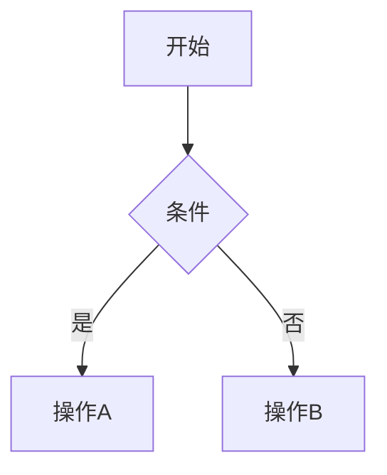

# Markdown 可视化编辑器

一个基于 React + TypeScript 的**两栏式 Markdown 实时预览编辑器**。左栏编写 Markdown，右栏实时渲染可视化效果，支持公众号、头条号、Mobile 等多平台格式导出。

---

## 功能特性

- **GFM 完整支持**：表格、删除线、任务列表、自动链接
- **数学公式**：行内 `$...$` 和块级 `$$...$$`，KaTeX 渲染
- **Mermaid 图表**：流程图、时序图等，解析失败不会导致页面崩溃
- **代码高亮**：shiki 引擎（VSCode 级精准度），支持行号 + 一键复制
- **脚注**：`[^1]` 语法支持
- **安全过滤**：自动过滤 `<script>` 和 `javascript:` 伪协议，防止 XSS 攻击
- **TOC 目录**：自动从标题生成，支持中文锚点
- **外部链接安全**：自动添加 `target="_blank"` 和 `rel="noopener noreferrer"`
- **深色 / 浅色主题**：一键切换，偏好自动保存
- **多平台格式**：默认、公众号、头条号、Mobile 四种预览模式
- **一键复制**：将格式化后的内容复制到剪贴板，直接粘贴到目标平台
- **响应式**：表格横向滚动、图片自适应、移动端适配

---

## 环境要求

| 工具 | 最低版本 | 检查命令 |
|------|---------|---------|
| Node.js | 18+ | `node -v` |
| npm | 9+ | `npm -v` |

> 如果没有安装 Node.js，请去 [https://nodejs.org/](https://nodejs.org/) 下载 LTS 版本并安装。安装完成后重新打开终端即可。

---

## 快速开始

### 第一步：进入项目目录

```bash
cd V:\markdown-visual-editor
```

### 第二步：安装依赖

```bash
npm install
```

> 首次安装大约需要 1-2 分钟，会下载约 400+ 个 npm 包。如果速度慢，可以先配置国内镜像：
>
> ```bash
> npm config set registry https://registry.npmmirror.com
> ```

### 第三步：启动开发服务器

```bash
npm run dev
```

启动成功后会看到类似输出：

```
VITE v8.x.x  ready in xxx ms

  ➜  Local:   http://localhost:5173/
```

### 第四步：打开浏览器

在浏览器中访问 **http://localhost:5173/**，即可看到编辑器界面。

---

## 使用说明

### 界面布局

```
┌─────────────────────────────────────────────────┐
│  MD  Markdown 可视化  [默认][公众号][头条号][Mobile]  [复制][🌙] │
├────────────────────────┬────────────────────────┤
│                        │                        │
│   Markdown 编辑区       │    实时预览区            │
│   （左栏）              │    （右栏）              │
│                        │                        │
└────────────────────────┴────────────────────────┘
```

- **左栏**：CodeMirror 编辑器，支持 Markdown 语法高亮、行号、搜索替换
- **右栏**：实时渲染预览，支持代码高亮、数学公式、Mermaid 图表
- **顶部工具栏**：格式切换 + 复制 + 主题切换

### 四种格式的区别

编辑器提供四种预览/导出格式，针对不同平台做了专门优化：

| 格式 | 适用场景 | 技术特点 |
|------|---------|---------|
| **默认** | 本地阅读、博客、文档 | 使用 CSS class 渲染，依赖 Tailwind Typography 排版，支持深色/浅色主题切换。效果最完整，代码高亮由 shiki 实时渲染，Mermaid 图表为 SVG。适合在浏览器中直接阅读。 |
| **公众号** | 微信公众号编辑器 | 所有样式**内联到每个 HTML 元素**上（`style="..."`），因为公众号编辑器会剥离 `<style>` 标签和 CSS class。主色调为微信绿（#07c160），标题带绿色边框，强调文字为绿色。数学公式的 KaTeX HTML 会移除 MathML 冗余节点并内联关键布局样式，确保粘贴后公式不会出现重复文字或排版错乱。 |
| **头条号** | 今日头条/头条号编辑器 | 同样采用**全内联样式**策略。字号比公众号略大（16px），行高 1.9，文字两端对齐。代码块使用深色背景（#282c34）。注意：头条号编辑器存在较多 HTML 限制，详见下方「头条号平台限制」。 |
| **Mobile** | 移动端效果预览 | 以 375px 宽度的**手机外框**形式展示内容，模拟 iPhone 屏幕尺寸。用于检查文章在手机上的实际阅读效果：图片是否超宽、表格是否需要横向滚动、代码块是否溢出等。 |

### 头条号平台限制

头条号编辑器对 HTML 的处理非常严格，以下是已知限制：

| 限制项 | 具体表现 | 本编辑器的应对方案 |
|--------|---------|------------------|
| **下标/上标标签被剥离** | `<sub>`、`<sup>` 标签会被头条号编辑器移除，导致数学公式的下标（如 `r_h`）和上标（如 `c²`）丢失 | 使用 Unicode 下标/上标字符替代（如 `ₕ`、`²`）。但 Unicode 中部分字母没有下标形式（`b, c, d, f, g, q, w, y, z`），这些字符会退化为普通文本 |
| **CSS 属性被过滤** | `vertical-align`、`position`、`top` 等 CSS 属性会被剥离 | 无法通过 CSS 模拟下标效果，因此采用 Unicode 字符方案 |
| **`class` 属性被剥离** | 所有 HTML 元素的 `class` 属性会被移除 | 所有样式内联到 `style` 属性中 |
| **`<style>` 标签被剥离** | 页面级样式表会被移除 | 不依赖 `<style>` 标签，全部使用内联样式 |
| **部分 `color` 可能不生效** | 头条号编辑器可能对内联 `color` 样式有选择性过滤 | 这是平台行为，非编辑器问题。如遇颜色不显示，属头条号编辑器限制 |
| **Mermaid 图表不支持** | SVG 图表会被头条号编辑器剥离 | 建议将 Mermaid 图表截图后以图片形式插入 |

> **总结**：头条号编辑器是目前主流平台中 HTML 兼容性最差的。对于数学公式较多的文章，建议优先使用公众号发布（公众号对 HTML 的兼容性好得多）。如果必须发头条号，公式中的下标/上标会尽可能使用 Unicode 字符（如 `rₕ` `c²`），但少数字母（如 `w`）无 Unicode 下标形式，会显示为普通字符。

**使用建议**：
- 写完文章后，先在「默认」格式下检查内容和排版
- 发布到公众号前，切换到「公众号」格式 → 点击「复制」→ 在公众号编辑器中 `Ctrl+V` 粘贴
- 发布到头条号前，切换到「头条号」格式 → 点击「复制」→ 粘贴
- 发布前用「Mobile」格式检查移动端效果

### 复制到平台

1. 选择目标格式（如"公众号"）
2. 点击工具栏「复制」按钮
3. 到目标平台编辑器中 `Ctrl+V` 粘贴

> 复制功能使用 Clipboard API 写入 `text/html` 格式，确保富文本格式被完整保留。

### 配色方案

点击工具栏的 🎨 按钮可选择 10 种预置配色方案，或使用自定义取色器：

| 配色 | 主色 | 风格 |
|------|------|------|
| 极客蓝（默认） | #2563eb | 经典蓝色，中性专业 |
| 微信绿 | #07c160 | 微信品牌色，清新自然 |
| 知乎蓝 | #0066ff | 知乎品牌色，知性沉稳 |
| 掘金蓝 | #1e80ff | 掘金品牌色，开发者风 |
| GitHub | #0969da | GitHub 品牌色，开源调性 |
| 优雅紫 | #7c3aed | 高贵紫色，优雅文艺 |
| 暖阳橙 | #ea580c | 温暖橙色，阳光明快 |
| 玫瑰红 | #e11d48 | 热情红色，醒目活泼 |
| 水墨灰 | #475569 | 低调灰色，沉稳内敛 |
| 森林绿 | #059669 | 深绿色调，复古文艺 |
| 自定义 | 用户选色 | 点击取色器自由选择 |

配色方案会同时影响预览和导出内容（公众号/头条号复制时使用当前配色的主色作为强调色）。每种配色提供浅色和深色版本，切换主题时自动适配。选择会自动保存。

### 主题切换

点击工具栏右侧的 🌙/☀️ 按钮切换深色/浅色主题。选择会自动保存，下次打开时恢复。

---

## 支持的 Markdown 语法

### 基础语法

```markdown
# 一级标题
## 二级标题
**粗体** *斜体* ~~删除线~~
[链接](https://example.com)

> 引用
- 无序列表
1. 有序列表
`行内代码`
---
```

### GFM 扩展

```markdown
- [x] 已完成任务
- [ ] 未完成任务

| 姓名 | 年龄 |
|------|------|
| 张三 | 25   |

~~删除线文本~~
```

### 数学公式

```markdown
行内公式：$E = mc^2$

块级公式：
$$
\int_{-\infty}^{\infty} e^{-x^2} dx = \sqrt{\pi}
$$
```

### 代码块

````markdown
```typescript
function hello(name: string): string {
  return `Hello, ${name}!`
}
```
````

### Mermaid 图表

````markdown

````

### 脚注

```markdown
这是一个脚注[^1]。

[^1]: 脚注内容
```

---

## 项目结构

```
V:\markdown-visual-editor\
├── index.html                    # 入口 HTML
├── package.json                  # 依赖配置
├── vite.config.ts                # Vite 构建配置
├── tsconfig.json                 # TypeScript 配置
└── src/
    ├── main.tsx                  # 应用入口
    ├── App.tsx                   # 根组件（管线驱动 + 防抖渲染）
    ├── index.css                 # 全局样式（Tailwind + 自定义）
    ├── components/
    │   ├── Editor.tsx            # CodeMirror 6 编辑器
    │   ├── Preview.tsx           # 预览渲染（挂载 Mermaid/CodeBlock 组件）
    │   ├── Toolbar.tsx           # 工具栏（格式切换 + 复制 + 主题）
    │   ├── TOC.tsx               # 自动目录（从标题提取）
    │   ├── CodeBlock.tsx         # 代码块（shiki 高亮 + 行号 + 复制）
    │   └── MermaidBlock.tsx      # Mermaid 图表（错误隔离渲染）
    ├── pipeline/
    │   ├── processor.ts          # unified 管线配置（所有插件串联）
    │   └── plugins/
    │       ├── rehype-mermaid.ts    # 将 mermaid 代码块转为可渲染 div
    │       ├── rehype-table-wrap.ts # 表格包裹滚动容器
    │       └── rehype-image.ts      # 图片懒加载 + 失效占位
    ├── formats/
    │   ├── wechat.ts             # 公众号内联样式转换器
    │   └── toutiao.ts            # 头条号内联样式转换器
    ├── themes/
    │   └── variables.css         # CSS 变量（浅色/深色主题）
    └── utils/
        ├── store.ts              # Zustand 状态管理
        ├── sample.ts             # 默认示例 Markdown 内容
        └── sanitize-schema.ts    # XSS 安全过滤规则
```

---

## 构建部署

### 构建生产版本

```bash
npm run build
```

构建产物输出到 `dist/` 目录。

### 本地预览构建结果

```bash
npm run preview
```

### 部署到静态服务器

将 `dist/` 目录中的所有文件上传到任意静态文件服务器即可（Nginx、Vercel、Netlify、GitHub Pages 等）。

**Nginx 示例配置：**

```nginx
server {
    listen 80;
    server_name your-domain.com;
    root /path/to/dist;
    index index.html;

    location / {
        try_files $uri $uri/ /index.html;
    }
}
```

---

## 常用命令

| 命令 | 说明 |
|------|------|
| `npm run dev` | 启动开发服务器（热更新） |
| `npm run build` | 构建生产版本 |
| `npm run preview` | 本地预览构建结果 |
| `npm run lint` | 运行 ESLint 代码检查 |

---

## 技术栈

| 类别 | 技术 | 用途 |
|------|------|------|
| 框架 | React 19 + TypeScript | 组件化 UI |
| 构建 | Vite 8 | 开发服务器 + 打包 |
| 编辑器 | CodeMirror 6 | Markdown 编辑（语法高亮、行号） |
| Markdown 解析 | unified + remark + rehype | AST 管线式解析与转换 |
| 代码高亮 | shiki | VSCode 级语法高亮 |
| 数学公式 | remark-math + rehype-katex | LaTeX 公式渲染 |
| 图表 | Mermaid | 流程图、时序图等 |
| 样式 | Tailwind CSS + Typography | 排版与主题 |
| 状态管理 | Zustand | 轻量级全局状态 |
| 安全 | rehype-sanitize | XSS 过滤 |

---

## 常见问题

### Q: 启动后页面空白？

检查浏览器控制台（F12）是否有报错。最常见的原因是依赖没有安装完整，尝试重新运行：

```bash
rm -rf node_modules
npm install
npm run dev
```

### Q: 公众号粘贴后样式丢失？

公众号编辑器会过滤 `<style>` 标签，所以本项目的公众号格式已将所有样式内联到每个 HTML 元素上。请确保：
1. 先切换到「公众号」格式
2. 点击「复制」按钮
3. 在公众号编辑器中粘贴

### Q: Mermaid 图表显示错误？

Mermaid 语法有误时会显示红色错误提示框，不会影响其他内容的渲染。请检查 Mermaid 语法是否正确，可参考 [Mermaid 官方文档](https://mermaid.js.org/)。

### Q: 数学公式没有渲染？

确保使用正确的语法：
- 行内公式用单个美元符号：`$E=mc^2$`
- 块级公式用双美元符号：`$$\sum_{i=1}^n x_i$$`

### Q: 如何修改主题颜色？

编辑 `src/themes/variables.css` 文件中的 CSS 变量即可自定义颜色方案。
