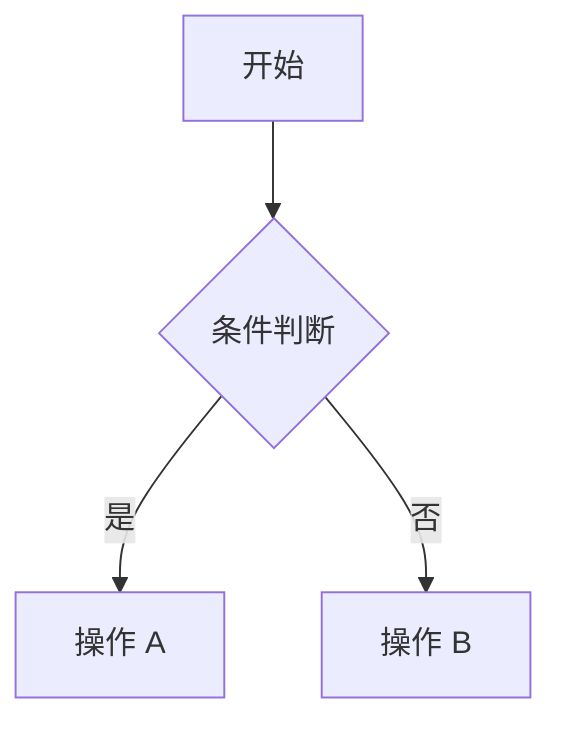

# Markdown 可视化编辑器

一个基于 React + TypeScript 的两栏式 Markdown 实时预览编辑器。
左侧编写 Markdown，右侧实时预览，支持 `默认 / 公众号 / 头条号 / Mobile` 四种格式，并支持复制格式化内容与按当前预览格式导出 PDF。

---

## 功能概览

- GFM 完整支持：表格、删除线、任务列表、自动链接
- 数学公式：支持行内 `$...$` 和块级 `$$...$$`，使用 KaTeX 渲染
- Mermaid 图表：支持流程图、时序图等，语法错误时不会拖垮整个页面
- 代码高亮：基于 Shiki，支持语言识别、行号、复制代码
- 脚注：支持 `[^1]` 语法
- TOC 目录：自动从标题生成，兼容中文锚点
- XSS 过滤：过滤 `<script>` 和 `javascript:` 等危险内容
- 多平台预览：默认、公众号、头条号、Mobile 四种模式
- 图片与视频：支持 Markdown 图片、扩展媒体指令、HTML video、本地媒体会话预览
- 一键复制：按当前目标格式复制 HTML 内容
- PDF 导出：按当前预览结果导出 PDF
- 深色 / 浅色主题：支持切换并自动保存偏好
- 配色方案：支持预设配色和自定义强调色
- 去 AI 味：可选地对文本做额外清理

---

## 环境要求

| 工具 | 推荐版本 | 检查命令 |
|------|----------|----------|
| Node.js | 18+ | `node -v` |
| pnpm | 9+ | `pnpm -v` |

说明：
- 本项目限制使用 `pnpm`
- 如果本机没有安装 `pnpm`，可以先执行：

```powershell
npm install -g pnpm
```

---

## 快速开始

### 1. 进入项目目录

```powershell
cd V:\markdown-visual-editor
```

### 2. 安装依赖

```powershell
pnpm install
```

### 3. 启动开发服务器

```powershell
pnpm dev
```

启动成功后会看到类似输出：

```text
VITE v8.x.x  ready in xxx ms

  Local:   http://localhost:5173/
```

### 4. 打开浏览器

访问：`http://localhost:5173/`

---

## 使用说明

### 界面结构

- 左侧：Markdown 编辑区
- 右侧：实时预览区
- 顶部工具栏：格式切换、插入图片、插入视频、复制、导出 PDF、去 AI 味、配色方案、主题切换

### 工具栏说明

| 控件 | 作用 |
|------|------|
| `默认 / 公众号 / 头条号 / Mobile` | 切换当前预览格式 |
| `图片` | 插入远程图片 URL 或本地图片文件 |
| `视频` | 插入远程视频 URL 或本地视频文件 |
| `复制` | 复制当前格式对应的内容 |
| `导出 PDF` | 将当前预览内容导出为 PDF |
| `去 AI 味` | 对文本做额外清理 |
| `调色` | 切换预设配色或自定义强调色 |
| 主题按钮 | 切换浅色 / 深色主题 |

### 四种格式说明

| 格式 | 适用场景 | 说明 |
|------|----------|------|
| 默认 | 本地阅读、博客预览 | 样式最完整，适合编辑和检查内容 |
| 公众号 | 微信公众号编辑器 | 会将关键样式尽量内联，便于复制粘贴 |
| 头条号 | 今日头条 / 头条号编辑器 | 针对头条号编辑器限制做适配 |
| Mobile | 手机端阅读效果检查 | 使用手机外框展示内容，适合检查移动端布局 |

推荐使用方式：
- 写作和校对阶段：优先用 `默认`
- 发公众号前：切到 `公众号` 后再复制或导出
- 发头条号前：切到 `头条号` 后再复制或导出
- 检查移动端效果：切到 `Mobile`

### PDF 导出说明

PDF 导出遵循一条原则：

- 当前在预览什么格式，就导出什么格式

例如：
- 当前是 `默认`，导出的是默认预览样式
- 当前是 `公众号`，导出的是公众号格式预览样式
- 当前是 `头条号`，导出的是头条号格式预览样式
- 当前是 `Mobile`，导出的是移动端外框预览样式

注意：
- 当前实现基于浏览器打印能力导出 PDF
- 不同浏览器在分页、缩放、页边距处理上可能略有差异
- 如果你希望导出结果尽量接近预览，建议优先使用 Chromium 内核浏览器

### 复制到目标平台

1. 先切换到目标格式
2. 点击 `复制`
3. 到目标平台编辑器中粘贴

说明：
- 远程图片会作为 HTML 图片节点复制
- 本地图片会做最佳努力复制：会写入 HTML，并在单图场景尝试附带图片二进制剪贴板项
- 视频在公众号 / 头条号模式下不会复制 `<video>`，而是转换成“封面 + 标题 + 链接”卡片
- 本地视频仅支持当前会话预览；复制到公众号 / 头条号前请提供公开链接和封面
- 复制功能优先使用 Clipboard API 写入 `text/html`
- 如果浏览器权限受限，会自动退回到普通复制方式

### 配色方案

支持多种预设配色，以及自定义强调色。
配色会影响：
- 预览中的强调色
- 公众号 / 头条号导出内容中的强调色
- PDF 导出中的当前视觉结果

### 主题切换

- 支持浅色 / 深色主题
- 切换结果会保存到本地，下次打开自动恢复

---

## 头条号平台限制

头条号编辑器对 HTML 和 CSS 的支持比较严格，以下是需要特别注意的点：

| 限制项 | 说明 |
|--------|------|
| `class` 可能被剥离 | 因此导出时需要依赖内联样式 |
| `<style>` 可能被过滤 | 外部样式和页面级样式不可靠 |
| 部分 CSS 属性可能失效 | 某些颜色、定位、垂直对齐可能不生效 |
| SVG / Mermaid 支持有限 | 复杂图表可能无法直接保留 |

建议：
- 数学公式、复杂图表较多时，优先使用公众号渠道发布
- 头条号发布前，先在目标平台编辑器里实际粘贴验证一次

---

## 支持的 Markdown 语法

### 基础语法

```markdown
# 一级标题
## 二级标题
**粗体** *斜体* ~~删除线~~
[链接](https://example.com)

> 引用
- 无序列表
1. 有序列表
`行内代码`
---
```

### GFM 扩展

```markdown
- [x] 已完成任务
- [ ] 未完成任务

| 姓名 | 年龄 |
|------|------|
| 张三 | 25   |

~~删除线文本~~
```

### 媒体语法

```markdown
::image{src="https://example.com/demo.png" alt="示例图片" caption="可选图注" width="720px"}

::video{src="https://example.com/demo.mp4" poster="https://example.com/poster.png" title="视频标题" href="https://example.com/watch"}

<video src="https://example.com/demo.mp4" poster="https://example.com/poster.png" controls title="HTML 视频"></video>
```

说明：
- `::image` 适合带图注、宽度控制的图片块
- `::video` 和 HTML `<video>` 都支持默认 / Mobile 实时预览
- 公众号 / 头条号模式下，视频会预览和导出为媒体卡片
- 本地图片 / 本地视频只在当前会话中可预览；刷新后需要重新选择文件

### 数学公式

```markdown
行内公式：$E = mc^2$

块级公式：
$$
\int_{-\infty}^{\infty} e^{-x^2} dx = \sqrt{\pi}
$$
```

### 代码块

````markdown
```typescript
function hello(name: string): string {
  return `Hello, ${name}!`
}
```
````

### Mermaid 图表

````markdown

````

### 脚注

```markdown
这是一个脚注示例[^1]。

[^1]: 这是脚注内容
```

---

## 项目结构

```text
V:\markdown-visual-editor\
├── index.html
├── package.json
├── vite.config.ts
├── tsconfig.json
├── tsconfig.app.json
├── tsconfig.node.json
├── public/
│   ├── favicon.svg
│   └── icons.svg
└── src/
    ├── main.tsx
    ├── App.tsx
    ├── index.css
    ├── assets/
    ├── components/
    │   ├── Editor.tsx
    │   ├── Preview.tsx
    │   ├── Toolbar.tsx
    │   ├── TOC.tsx
    │   ├── CodeBlock.tsx
    │   └── MermaidBlock.tsx
    ├── pipeline/
    │   ├── processor.ts
    │   └── plugins/
    │       ├── rehype-image.ts
    │       ├── rehype-mermaid.ts
    │       ├── rehype-table-wrap.ts
    │       └── remark-deai.ts
    ├── formats/
    │   ├── katex-inline.ts
    │   ├── wechat.ts
    │   └── toutiao.ts
    ├── themes/
    │   └── variables.css
    └── utils/
        ├── color-schemes.ts
        ├── pdf.ts
        ├── sample.ts
        ├── sanitize-schema.ts
        └── store.ts
```

---

## 构建与部署

### 本地开发

```powershell
pnpm dev
```

### 构建生产版本

```powershell
pnpm build
```

构建产物输出到：`dist/`

### 本地预览构建结果

```powershell
pnpm preview
```

### 部署到静态服务器

将 `dist/` 目录部署到任意静态文件服务器即可，例如：
- Nginx
- Vercel
- Netlify
- GitHub Pages

Nginx 示例：

```nginx
server {
    listen 80;
    server_name your-domain.com;
    root /path/to/dist;
    index index.html;

    location / {
        try_files $uri $uri/ /index.html;
    }
}
```

---

## 常用命令

| 命令 | 说明 |
|------|------|
| `pnpm dev` | 启动开发服务器 |
| `pnpm build` | 构建生产版本 |
| `pnpm preview` | 本地预览构建结果 |
| `pnpm lint` | 运行 ESLint 检查 |

---

## 技术栈

| 类别 | 技术 | 用途 |
|------|------|------|
| 框架 | React 19 + TypeScript | UI 组件与类型系统 |
| 构建 | Vite 8 | 开发服务与打包 |
| 编辑器 | CodeMirror 6 | Markdown 编辑 |
| Markdown 解析 | unified + remark + rehype | AST 解析与转换 |
| 代码高亮 | Shiki | 语法高亮 |
| 数学公式 | remark-math + rehype-katex | 公式渲染 |
| 图表 | Mermaid | 图表渲染 |
| 样式 | Tailwind CSS | 基础样式系统 |
| 状态管理 | Zustand | 全局状态 |
| 安全 | rehype-sanitize | XSS 过滤 |

---

## 常见问题

### Q: 为什么 `npm install` 不行？

因为项目限制使用 `pnpm`。请改用：

```powershell
pnpm install
```

### Q: 启动后页面空白怎么办？

优先检查：
- 终端是否有构建报错
- 浏览器控制台是否有运行时报错
- 依赖是否安装完整

可以尝试重新安装依赖：

```powershell
Remove-Item -Recurse -Force node_modules
pnpm install
pnpm dev
```

### Q: 公众号粘贴后样式丢失怎么办？

请确认操作顺序：
1. 切换到 `公众号` 模式
2. 点击 `复制`
3. 在公众号编辑器中粘贴

如果直接复制默认模式内容，目标平台通常不会保留预期样式。

### Q: 为什么导出的 PDF 和页面预览有差异？

当前 PDF 导出基于浏览器打印能力实现，可能在以下方面存在差异：
- 分页位置
- 页边距
- 缩放比例
- 某些浏览器的打印样式处理

如果你非常依赖导出一致性，建议优先使用 Chromium 内核浏览器测试。

### Q: 本地图片和本地视频复制到平台时有什么限制？

- 本地图片：当前实现是最佳努力复制，不是稳定上传能力
- 单张本地图片场景会尝试同时写入 HTML 和图片剪贴板项
- 多张本地图片或复杂混排内容，最终是否自动上传取决于浏览器和目标编辑器
- 本地视频不会直接复制到公众号 / 头条号；请提供公开链接和封面，系统会导出为媒体卡片

### Q: Mermaid 图表显示错误怎么办？

Mermaid 语法错误时会显示错误提示，而不是让整个页面崩溃。
请检查图表语法，必要时参考官方文档：
- `https://mermaid.js.org/`

### Q: 数学公式没有渲染怎么办？

请确认语法正确：
- 行内公式：`$E=mc^2$`
- 块级公式：

```markdown
$$
\sum_{i=1}^{n} x_i
$$
```

### Q: 如何修改主题或强调色？

- 日常使用：直接通过顶部工具栏切换
- 想改默认主题变量：编辑 `src/themes/variables.css`
- 想调整配色方案：查看 `src/utils/color-schemes.ts`
